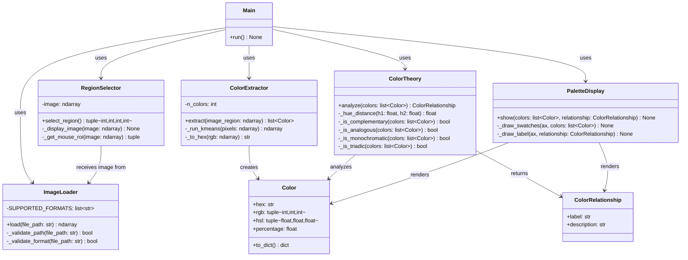
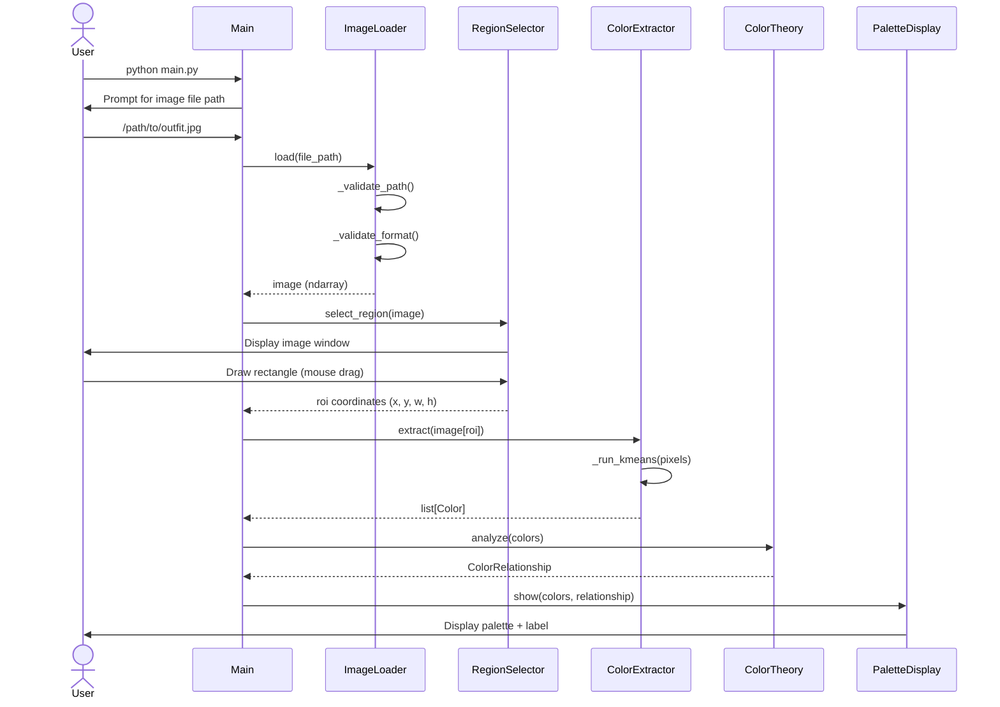
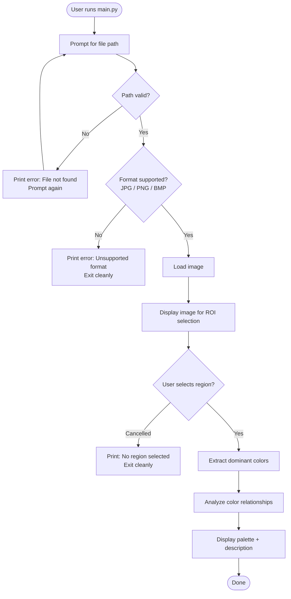

# UML Design — V1: Color Palette Explorer
**Project:** AI Personal Styling Assistant  
**Version:** 1.0  
**Author:** Jennaya Horne  
**Date:** 2026-08-05  

---

## Overview

This document captures the structural and behavioral design of the V1 Color Palette Explorer using UML diagrams. It translates the SRS requirements into concrete modules, classes, and functions ready for implementation.

---

## 1. Module Architecture (Package Diagram)

```
src/
└── v1_color_explorer/
    ├── main.py              ← Entry point; orchestrates the full workflow
    ├── image_loader.py      ← FR-01, FR-02, FR-03 — Load & validate image input
    ├── region_selector.py   ← FR-04 — Let user select a region of interest (ROI)
    ├── color_extractor.py   ← FR-05 — Extract dominant colors from ROI
    ├── palette_display.py   ← FR-06 — Render visual color palette
    └── color_theory.py      ← FR-07, FR-08 — Identify and describe color relationships
```

Each module maps directly to one or more functional requirements from the SRS.

---

## 2. Class Diagram



---

## 3. Sequence Diagram — Happy Path



---

## 4. Error Flow Diagram



---

## 5. Module Responsibilities Summary

| Module | Key Responsibility | SRS Req |
|--------|-------------------|---------|
| `main.py` | Orchestrates all modules; entry point | — |
| `image_loader.py` | Accept file path, validate, load image | FR-01, FR-02, FR-03, NFR-05 |
| `region_selector.py` | Display image, let user draw ROI | FR-04 |
| `color_extractor.py` | Run K-Means on ROI pixels, return Color objects | FR-05 |
| `color_theory.py` | Classify palette (complementary, analogous, etc.) | FR-07, FR-08 |
| `palette_display.py` | Render visual palette with labels | FR-06 |

---

## 6. Key Design Decisions

| Decision | Choice | Rationale |
|----------|--------|-----------|
| Color extraction algorithm | K-Means clustering (`sklearn` or manual `numpy`) | Industry-standard approach for dominant color extraction |
| ROI selection method | OpenCV `selectROI()` | Built-in, mouse-driven, works terminal-first |
| Color representation | Store as `hex`, `rgb`, and `hsl` | HSL needed for color theory math; hex/rgb for display |
| Color count (K) | Default `k=5` dominant colors | Balances detail and readability for outfit palettes |
| Color theory math | Hue-angle distance on HSL wheel | Standard colorimetry approach |

---

## 7. Open Questions

> [!IMPORTANT]
> These decisions will shape implementation and should be confirmed before coding.

1. **ROI Selection Method**: Should the user draw the region with a mouse (using `cv2.selectROI`), or would you prefer to also support text input of pixel coordinates as a fallback?
2. **K (number of dominant colors)**: Should the number of extracted colors be fixed at 5, user-configurable via a flag, or automatically determined?
3. **Color Theory Scope**: The SRS mentions complementary, monochromatic, and analogous. Should we also handle **triadic** and **split-complementary** in V1, or defer to V2?
4. **Palette Output Format**: Should the palette window stay open until the user closes it, or auto-close after a timeout?
